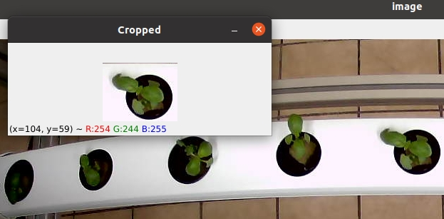

# Cropping Image Generator

### This is useful to get multiple (or single) cropped images from input image.

## How to Use?

### 1. Run the code
python crop_gen.py --input {input directory} --output {output directory} --type {type of cropped image} \
ex) python crop_gen.py --input input --output output --type basil 

### 2.Drag from top left to bottom right. 

### 3. Check if the cropped image is okay. 
3-1. Want to save? and more cropping in the same image? --> press **c**  \
3-2. Don't want to save? and recropping in the same image? --> press **r**  \
3-3. Don't want to save? move to the next image? --> press **q** 